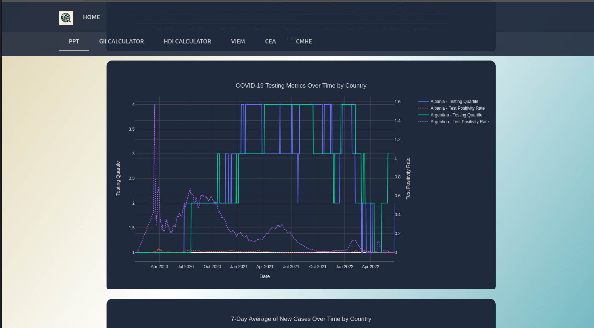

# COP5725 - Database Management Systems: COVID-19 Impact Visualization

# Description
Welcome to the GitHub repository for our semester-long project in COP5725 - Database Management Systems. In this project, we have developed a comprehensive database and visualization tool to explore and understand the various impacts of COVID-19. The COVID-19 Impact Visualization project leverages database management techniques and modern web technologies to provide insightful and interactive trend analysis. COP5725 - Database Management Systems: COVID-19 Impact Visualization

This project is a comprehensive database and visualization tool developed for COP5725 - Database Management Systems. It provides insightful and interactive trend analysis of the various impacts of COVID-19.

This website is hosted on AWS and can be accessed via:
[Live Website](http://18.205.28.126:3000/)



## Getting Started

### Prerequisites

- Python 3.8 or later
- MySQL 8.0 or later
- Node.js and npm

### Setting Up the Server
First create a `.env` file from `.env.example` in the backend folder.
### Clone the repository:
```sh
git clone https://github.com/Dhruv-mak/Pandemic_Insights.git
```
### Script for setup
Run the script which will do all the setup for you.
Note: This script is only for debian based systems. If you use any other system I have given detailed description on how to manually Install everything.
```sh
cd Pandemic_Insights
./setup.sh
```

### Manual setup
- Database setup
```sh
wget https://dev.mysql.com/get/mysql-apt-config_0.8.29-1_all.deb
sudo dpkg -i mysql-apt-config_0.8.29-1_all.deb
sudo apt-get update
sudo apt-get install mysql-server
rm mysql-apt-config_0.8.29-1_all.deb
mysql -u root -p -e "CREATE USER IF NOT EXISTS 'dmakwana'@'localhost' IDENTIFIED BY '<choose your password>;"
mysql -u root -p -e "GRANT ALL PRIVILEGES ON Covid.* TO 'dmakwana'@'localhost' WITH GRANT OPTION;"
mysql -e "FLUSH PRIVILEGES;"
```

- backend setup
```sh
cd backend
pip install -r requirements.txt
```

- frontend setup
```sh
cd frontend
npm install
```

After doing this initial setup run the following command to populate the database.
```sh
flask table_master populate-table
```

### running the server
For backend:
```sh
flask run
```

For frontend(dev server):
```sh
npm start
```